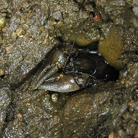

# Two-Way Summary {#ANOVA2Summary}
Specific parts of a full Two-Way ANOVA analysis were described in Module \@ref(ANOVA2Analysis). In this module, a workflow for a full analysis is offered and that workflow is demonstrated with several examples.

## Suggested Workflow
The following is a process for fitting a Two-Way ANOVA model. Consider this process as you learn to fit Two-Way ANOVA models, but don't consider this to be a concrete process for all models.

<!---
1. Perform a thorough EDA of the quantitative response variable. Pay special attention to the distributional shape, center, dispersion, and outliers within each level of the grouping variable.
---->
1. Show the sample size per group and comment on whether the study was balanced (i.e., same sample size per group) or not.
1. Address the independence assumption.
    * If this assumption is not met then other analysis methods must be used.^[This will not be the case in this course.]
1. Fit the untransformed ultimate full model (i.e., both main effects and the interaction effect) model with `lm()`.
1. Check the other three assumptions for the untransformed model with `assumptionCheck()`.
    * Check equality of variances with a Levene's test and residual plot.
    * Check normality of residuals with a Anderson-Darling test and histogram of residuals.
    * Check for outliers with an outlier test, residual plot, and histogram of residuals.
1. If an assumption or assumptions are violated, then attempt to find a transformation where the assumptions are met.
    * Use the trial-and-error method with `assumptionCheck()`, theory, or experience to identify a possible transformation. Always try the log transformation first.
    * If only an outlier exists (i.e., there are equal variances and normal residuals) and no transformation corrects the outlier then consider removing the outlier from the data set.
    * Fit the ultimate full model with the transformed response or reduced data set.
1. Construct an ANOVA table for the full model with `anova()`.
    * If a significant interaction exists then do NOT interpret the main effects!!
    * If a significant interaction does NOT exist then interpret the main effects.
        * Fit a new model without the insignificant interaction term.
1. If an effect exists, then use a multiple comparison technique with `emmeans()` and `summary()` to identify specific differences. Describe specific differences using confidence intervals.
    * If a significant interaction exists then perform multiple comparisons on the interaction term using the model that contained an interaction term.
    * If a significant interaction does not exist then perform multiple comparisons for each factor for which a main effect exists using the model without an interaction term.
1. Create a summary graphic of treatment means (i.e., an interaction plot) **on the original scale** with 95% confidence intervals using `ggplot()` and results from `emmeans()` using the model with an interaction term.
1. Write a succinct conclusion of your findings.

&nbsp;

## Expected Prices (*No Transformation*)

Managers of a retail store felt that the price that consumers expect to pay for a product would be influenced by how much the product was promoted and the advertised amount of discount. To examine this, they gathered 160 volunteers (from different households) who would receive information about the store's products for a 10-week period. Each volunteer was randomly chosen to receive promotions about one particular product 1, 3, 5, or 7 times during that period and with an advertised discount of 10, 20, 30, or 40%. At the end of the 10-week period the researchers asked each participant to report the price they expected to pay for the product.^[This example is modified from [Alwyn *et al.* (2020)](https://www.macmillanlearning.com/college/us/product/The-Practice-of-Statistics-for-Business-and-Economics/p/1319109004) who based it on [Kalwani and Kim (1992)](https://psycnet.apa.org/record/1992-21809-001).]

The statistical hypotheses to be examined are

$$
\begin{split}
   H_{0}&: ``\text{no interaction effect''} \\
   H_{A}&: ``\text{interaction effect''}
\end{split}
$$

$$
\begin{split}
   H_{0}&: ``\text{no promotions effect''}: \mu_{1} = \mu_{3} = \mu_{5} = \mu_{7} \\
   H_{A}&: ``\text{promotions effect''}: \text{At least one pair of level means is different}
\end{split}
$$

$$
\begin{split}
   H_{0}&: ``\text{no discount effect''}: \mu_{10} = \mu_{20} = \mu_{30} = \mu_{40} \\
   H_{A}&: ``\text{discount effect''}: \text{At least one pair of level means is different}
\end{split}
$$

where $\mu$ is the mean expected price and the subscripts identify the levels of each factor as defined above.

```{r DiscountData, echo=FALSE}
d <- read.csv("http://derekogle.com/Book207/data/Discount.csv")
d$Promo <- factor(d$Promo)        # because recorded as numbers
d$Discount <- factor(d$Discount)  # because recorded as numbers
lm1.d <- lm(Eprice~Promo+Discount+Promo:Discount,data=d)
```

```{r echo=FALSE}
p.lev.d <- levenesTest(Eprice~Promo*Discount,data=d)$"Pr(>F)"[1]
p.ad.d <- adTest(lm1.d$residuals)$p.value
p.out.d <- outlierTest(lm1.d)$bonf.p
```

This study was "balanced" as the number of participants was the same in each combination of number of promotions and amount of discount (Table \@ref(tab:DiscountSampleSize)).

```{r DiscountSampleSize, echo=FALSE}
xtabs(~Promo+Discount,data=d) %>%
  knitr::kable(booktabs=TRUE,caption="Number of participants in each combination of number of promotions and amount of discount.") %>%
  kableExtra::kable_classic("hover",full_width=FALSE,html_font=khfont) %>%
  kableExtra::add_header_above(c(" "=1,"Discounts"=4),bold=TRUE) %>%
  kableExtra::pack_rows("Promotions",1,4) %>%
  kableExtra::column_spec(1,width="6em")
```

&nbsp;

Variances among the treatments appear to be constant (Levene's `r kPvalue(p.lev.d,latex=FALSE)`) and the boxplots of residuals appear fairly similar given the small group sample size (Figure \@ref(fig:DiscountResidPlot)-Right); the residuals appear to be approximately normally distributed (Anderson-Darling `r kPvalue(p.ad.d,latex=FALSE)`; Figure \@ref(fig:DiscountResidPlot)-Left); and there are no significant outliers (outlier test `r kPvalue(p.out.d,latex=FALSE)`), though some residuals appear somewhat larger in some treatments (Figure \@ref(fig:DiscountResidPlot)-Right).

&nbsp;

```{r DiscountResidPlot, echo=FALSE, fig.width=7, fig.cap="Histogram of residuals (Left) and residual plot (Right) for a Two-way ANOVA of expected price for each combination of number of promotions and discount rate."}
assumptionCheck(lm1.d)
```

&nbsp;

The participants were not randomly selected for the study but they were specifically not from the same household and they were randomly allocated to the combination of number of promotions and discount amount. Thus, there is no reason to believe that individuals are connected either within or among treatments. Thus, the independence assumption appears to have been met. These data will be examined with a Two-Way ANOVA without transformation because all assumptions have been adequately met.

```{r echo=FALSE}
aov1.d <- anova(lm1.d)
p.aov1.d <- aov1.d$"Pr(>F)"
```

```{r DiscountData2, echo=FALSE}
lm1.d.noint <- lm(Eprice~Promo+Discount,data=d)
```

```{r echo=FALSE}
mc1.d.promo <- emmeans(lm1.d.noint,specs=pairwise~Promo)
mc1sum.d.promo <- summary(mc1.d.promo,infer=TRUE)

mc1.d.discount <- emmeans(lm1.d.noint,specs=pairwise~Discount)
mc1sum.d.discount <- summary(mc1.d.discount,infer=TRUE)
```

There does not appear to be a significant interaction effect (`r kPvalue(p.aov1.d[3],latex=FALSE)`; Table \@ref(tab:DiscountAnova)). There does however appear to be main effects for both the number of promotions (`r kPvalue(p.aov1.d[1],latex=FALSE)`) and amount of discount (`r kPvalue(p.aov1.d[2],latex=FALSE)`).

```{r DiscountAnova, echo=FALSE}
knitr::kable(aov1.d,booktabs=TRUE,digits=c(1,3,3,3,4),
             caption="Two-way ANOVA results for expected price among different numbers of promotions and amounts of discount.") %>%
    kableExtra::kable_classic("hover",full_width=FALSE,html_font=khfont)
```

&nbsp;

Tukey's multiple comparison results suggest that the mean expected price does not differ between when one and three promotions are used (`r kPvalue(mc1sum.d.promo$contrasts$p.value[1],latex=FALSE)`) but does decline from three to five promotions (`r kPvalue(mc1sum.d.promo$contrasts$p.value[4],latex=FALSE)`) and from five to seven promotions (`r kPvalue(mc1sum.d.promo$contrasts$p.value[6],latex=FALSE)`; Table \@ref(tab:DiscountPromoTukey)). For example, the mean expected price drops between `r formatC(mc1sum.d.promo$contrasts$lower.CL[4],format="f",digits=2)` and `r formatC(mc1sum.d.promo$contrasts$upper.CL[4],format="f",digits=2)` dollars from three to five promotions and between `r formatC(mc1sum.d.promo$contrasts$lower.CL[6],format="f",digits=2)` and `r formatC(mc1sum.d.promo$contrasts$upper.CL[6],format="f",digits=2)` dollars from five to seven promotions.

```{r DiscountPromoTukey, echo=FALSE}
knitr::kable(mc1sum.d.promo$contrasts[c(1,2,5,6,8)],booktabs=TRUE,digits=c(0,2,2,2,4),
             caption="Tukey's multiple comparisons of differences in mean expected price among all pairs of numbers of promotions.") %>%
    kableExtra::kable_classic("hover",full_width=FALSE,html_font=khfont)
```

&nbsp;

Tukey's multiple comparison results suggest that the mean expected price differed between all pairs of amounts of discount (p&le;`r kPvalue(max(mc1sum.d.discount$contrasts$p.value),latex=FALSE,include.p=FALSE)`; Table \@ref(tab:DiscountDiscountTukey)). The mean expected price declined between `r formatC(mc1sum.d.discount$contrasts$lower.CL[1],format="f",digits=2)` and `r formatC(mc1sum.d.discount$contrasts$upper.CL[1],format="f",digits=2)` dollars from a discount rate of 10% to 20% (`r kPvalue(mc1sum.d.discount$contrasts$p.value[1],latex=FALSE)`) and between `r formatC(mc1sum.d.discount$contrasts$lower.CL[4],format="f",digits=2)` and `r formatC(mc1sum.d.discount$contrasts$upper.CL[4],format="f",digits=2)` dollars from a discount rate of 20% to 30% (`r kPvalue(mc1sum.d.discount$contrasts$p.value[4],latex=FALSE)`), but increased  between `r formatC(-1*mc1sum.d.discount$contrasts$upper.CL[6],format="f",digits=2)` and `r formatC(-1*mc1sum.d.discount$contrasts$lower.CL[6],format="f",digits=2)` dollars from a discount rate of 30% to 40% (`r kPvalue(mc1sum.d.discount$contrasts$p.value[6],latex=FALSE)`).

```{r DiscountDiscountTukey, echo=FALSE}
knitr::kable(mc1sum.d.discount$contrasts[c(1,2,5,6,8)],booktabs=TRUE,digits=c(0,2,2,2,4),
             caption="Tukey's multiple comparisons of differences in mean expected price among all pairs of amounts of discount.") %>%
    kableExtra::kable_classic("hover",full_width=FALSE,html_font=khfont)
```

&nbsp;

From these results it appears that if there is no difference in mean expected price for three or less promotions, but after that the mean expected price drops with increasing numbers of promotions, regardless of the amount of discount offered. Regardless of the number of promotions, consumers expect to pay less with increasing amount of discount up to 30%, but the mean expected price increased when the discount was increased to 40% (Figure \@ref(fig:DiscountFitPlot)).

&nbsp;

```{r DiscountFitPlot, echo=FALSE, fig.width=4.5, fig.cap="Mean expected price for each combination of number of promotions and discount amount."}
mc1.d <- emmeans(lm1.d,specs=pairwise~Promo:Discount)
mc1sum.d <- summary(mc1.d,infer=TRUE)
pd <- position_dodge(width=0.1)
ggplot(data=mc1sum.d$emmeans,
       mapping=aes(x=Promo,group=Discount,color=Discount,
                   y=emmean,ymin=lower.CL,ymax=upper.CL)) +
  geom_line(position=pd,size=1.1,alpha=0.25) +
  geom_errorbar(position=pd,size=2,width=0) +
  geom_point(position=pd,size=2,pch=21,fill="white") +
  labs(y="Expected Price",x="Number of Promotions") +
  theme_NCStats()
```

#### R Code and Results {-}
```{r results="hide",fig.show="hide"}
<<DiscountData>>
xtabs(~Promo+Discount,data=d)
<<DiscountResidPlot>>
anova(lm1.d)
<<DiscountData2>>
mc1.d.promo <- emmeans(lm1.d.noint,specs=pairwise~Promo)
( mc1sum.d.promo <- summary(mc1.d.promo,infer=TRUE) )
mc1.d.discount <- emmeans(lm1.d.noint,specs=pairwise~Discount)
( mc1sum.d.discount <- summary(mc1.d.discount,infer=TRUE) )
<<DiscountFitPlot>>
```

&nbsp;

## Blood Pressure (*No Transformation*)

Sodium (Na) plays an important role in the genesis of high blood pressure, and the kidney is the principal organ that regulates the amount of sodium in the body. The kidney contains the [Na-K-ATPase enzyme](https://en.wikipedia.org/wiki/Na%2B/K%2B-ATPase), which is essential for maintaining proper sodium levels. If the enzyme does not function properly, then high blood pressure may result. The activity of this enzyme has been studied in whole kidneys, even though the kidney is known to contain many functionally distinct sites. To see whether any particular site of Na-K-ATPase activity was abnormal with [hypertension](https://www.mayoclinic.org/diseases-conditions/high-blood-pressure/symptoms-causes/syc-20373410), [Garg *et al.* (1985)](https://journals.physiology.org/doi/abs/10.1152/ajprenal.1985.249.6.f863) studied Na-K-ATPase activity at different sites along the [nephrons](https://en.wikipedia.org/wiki/Nephron) of normal rats and specially-bred rats which spontaneously develop hypertension. The sites in the kidney examined were the [distal collecting tubule](https://en.wikipedia.org/wiki/Distal_convoluted_tubule) (DCT), [cortical collecting duct](https://en.wikipedia.org/wiki/Collecting_duct_system) (CCD), and [outer medullary collecting duct](https://en.wikipedia.org/wiki/Collecting_duct_system#Outer_segment) (OMCD).

The researchers hypothesized that the level of Na-K-ATPase would be depressed at all sites in the rats with hypertension. This translates to expecting a rat strain effect but not an interaction effect. The authors were also interested in determining if there was a significant difference in the level of Na-K-ATPase activity at the different sites. Thus, the statistical hypotheses to be examined were


$$
\begin{split}
   H_{0}&: ``\text{no interaction effect''} \\
   H_{A}&: ``\text{interaction effect''}
\end{split}
$$

$$
\begin{split}
   H_{0}&: ``\text{no rat strain effect''}: \mu_{Normal} = \mu_{Hyper} \\
   H_{A}&: ``\text{rat strain effect''}: \mu_{Normal} \neq \mu_{Hyper}
\end{split}
$$

$$
\begin{split}
   H_{0}&: ``\text{no site effect''}: \mu_{DCT} = \mu_{CCD} = \mu_{OMCD} \\
   H_{A}&: ``\text{site effect''}: \text{At least one pair of level means is different}
\end{split}
$$

where $\mu$ is the mean Na-K-ATPase activity and the subscripts identify the levels of each factor as defined above.

Twelve rats were randomly selected for each strain of rat (i.e., normal rats and rats with hypertension) from all rats available in the author's laboratory. The site of the kidney (DCT, CCD, or OMCD) where the Na-K-ATPase activity ($pmol\cdot(min\cdot mm)^{-1}$) was recorded on a rat was also randomly selected so that measurements at each location were recorded from four rats.^[A better design would have measured the Na-K-ATPase activity at all three sites from the same rates. However, this would have violated the independence assumption and required other methods (repeated-measures or mixed-models) to analyze the data.]

```{r NAKData, echo=FALSE}
nak <- read.csv("http://derekogle.com/Book207/data/NAKATPase.csv")
lm1.nak <- lm(activity~strain+site+strain:site,data=nak)
```

```{r NAKSampleSize, echo=FALSE}
xtabs(~strain+site,data=nak) %>%
  knitr::kable(booktabs=TRUE,caption="Number of rats in each combination of rat strain and kidney site.") %>%
  kableExtra::kable_classic("hover",full_width=FALSE,html_font=khfont) %>%
  kableExtra::add_header_above(c(" "=1,"Kidney Site"=3),bold=TRUE) %>%
  kableExtra::pack_rows("Strain",1,2) %>%
  kableExtra::column_spec(1,width="6em")
```

```{r echo=FALSE}
p.lev.nak <- levenesTest(activity~factor(strain)*factor(site),data=nak)$"Pr(>F)"[1]
p.ad.nak <- adTest(lm1.nak$residuals)$p.value
p.out.nak <- outlierTest(lm1.nak)$bonf.p
```

&nbsp;

Variances among treatments appear to be constant (Levene's `r kPvalue(p.lev.nak,latex=FALSE)`) though the boxplots of residuals appear somewhat divergent (Figure \@ref(fig:NAKResidPlot)-Right), likely due to the small number of rats per treatment; the residuals appear to be approximately normally distributed (Anderson-Darling `r kPvalue(p.ad.nak,latex=FALSE)`; Figure \@ref(fig:NAKResidPlot)-Left); and there are no significant outliers (outlier test `r kPvalue(p.out.nak,latex=FALSE)`).

&nbsp;

```{r NAKResidPlot, echo=FALSE, fig.width=7, fig.cap="Histogram of residuals (Left) and residual plot (Right) for a Two-way ANOVA of Na-K-ATPase activity for each combination of rat type and measurement location."}
assumptionCheck(lm1.nak)
```

&nbsp;

The rats are probably independent among strains as there is no evidence that "normal" and "hypertensive" rats are in any way related or that a rat could be in both groups. Independence of rats within strains is suspect given that the rats came from the same "pool" of normal and hypertensive rats bred in the lab. This may be acceptable for this experiment, but drawing conclusions to a larger population of rats may be suspect. Finally, rats are likely independent among kidney site groups as a different site was examined for each individual rat (i.e., all three sites were not examined on the same rat). All-in-all, independence is likely met enough to continue with this analysis. Thus, these data will be examined with a two-way ANOVA without transformation because the assumptions have been adequately met.

```{r echo=FALSE}
aov1.nak <- anova(lm1.nak)
p.aov1.nak <- aov1.nak$"Pr(>F)"

mc1.nak <- emmeans(lm1.nak,specs=pairwise~site:strain)
mc1sum.nak <- summary(mc1.nak,infer=TRUE)
```

There appears to be a (weakly) significant interaction effect (`r kPvalue(p.aov1.nak[3],latex=FALSE)`; Table \@ref(tab:NAKAnova)); thus, the main effects cannot be interpreted directly from these results.

&nbsp;

```{r NAKAnova, echo=FALSE}
knitr::kable(aov1.nak,booktabs=TRUE,digits=c(0,1,1,3,4),
             caption="Two-way ANOVA results for Na-K-ATPase activity levels among two strains of rats and three sites in the kidney.") %>%
    kableExtra::kable_classic("hover",full_width=FALSE,html_font=khfont)
```

```{r echo=FALSE}
CCDnOMCDbyStrain <- min(mc1sum.nak$contrasts$p.value[c(3,12)])
DCT <- max(mc1sum.nak$contrasts$p.value[c(1,6,13,15)])
CCDnOMCD <- min(mc1sum.nak$contrasts$p.value[c(2,14)])
```

&nbsp;

Tukey's method was performed on the interaction effect to more specifically describe the differences among group means (Table \@ref(tab:NAKTukey)). The mean level of Na-K-ATPase activity was significantly lower for the hypertensive rats then for the normal rats at the DCT site (`r kPvalue(mc1sum.nak$contrasts$p.value[8],latex=FALSE)`), but not at the other two sites (p&ge;`r kPvalue(CCDnOMCDbyStrain,latex=FALSE,include.p=FALSE)`). For example, the mean level of Na-K-ATPase activity was between `r formatC(-1*mc1sum.nak$contrasts$upper.CL[8],format="f",digits=1)` and `r formatC(-1*mc1sum.nak$contrasts$lower.CL[8],format="f",digits=1)` units lower in hypertensive than normal rats at the DCT site. In addition, the mean level of Na-K-ATPase activity was significantly greater at the DCT site than at the CCD and OMCD sites within both strains (p&le;`r kPvalue(DCT,latex=FALSE,include.p=FALSE)`), and Na-K-ATPase activity did not differ between the CCD and OMCD sites for either strain (p&ge;`r kPvalue(CCDnOMCD,latex=FALSE,include.p=FALSE)`). For example, the mean level of Na-K-ATPase activity was between `r formatC(mc1sum.nak$contrasts$lower.CL[15],format="f",digits=1)` and `r formatC(mc1sum.nak$contrasts$upper.CL[15],format="f",digits=1)` units higher at the DCT than at the OMCD site for normal rats.

&nbsp;

```{r NAKTukey, echo=FALSE}
knitr::kable(mc1sum.nak$contrasts[c(1,2,5,6,8)],booktabs=TRUE,digits=c(0,2,2,2,4),
             caption="Tukey's multiple comparisons of differences in means among all pairs of combinations of rat strain and kidney measurement site.") %>%
    kableExtra::kable_classic("hover",full_width=FALSE,html_font=khfont)
```

::: {.tip data-latex=""}
It can be difficult to interpret multiple comparisons when an interaction exists, especially if there are many differences among treatment means. A strategy to handle this is to describe how one factor differs among levels of the other factor (e.g., how strain differed among sites) and then vice-versa (e.g., how sites differed among strains).
:::

There is some support for the researcher's hypothesis that Na-K-ATPase activity levels would be lower in rats with hypertension (Figure \@ref(fig:NAKFitPlot)). However, this support was found only for the distal collecting tubule (DCT) site. At all other sites, no difference between hypertensive and normal rats was observed. Furthermore, Na-K-ATPase activity was higher at the DCT site then either of the other two sites for both normal and hypertensive rats.

```{r NAKFitPlot, echo=FALSE, fig.width=4.5, fig.cap="Mean Na-K-ATPase activity for each combination of rat strain and kidnety measurement site."}
pd <- position_dodge(width=0.1)
ggplot(data=mc1sum.nak$emmeans,
       mapping=aes(x=site,group=strain,color=strain,
                   y=emmean,ymin=lower.CL,ymax=upper.CL)) +
  geom_line(position=pd,size=1.1,alpha=0.25) +
  geom_errorbar(position=pd,size=2,width=0) +
  geom_point(position=pd,size=2,pch=21,fill="white") +
  labs(y="Na-K-ATPase Activity",x="Kidney Measurement Site") +
  theme_NCStats()
```

#### R Code and Results {-}
```{r results="hide",fig.show="hide"}
<<NAKData>>
xtabs(~strain+site,data=nak)
<<NAKResidPlot>>
anova(lm1.nak)
mc1.nak <- emmeans(lm1.nak,specs=pairwise~site:strain)
( mc1sum.nak <- summary(mc1.nak,infer=TRUE) )
<<NAKFitPlot>>
```

&nbsp;

## Crayfish Foraging (*Transformation*)
```{r echo=FALSE, eval=FALSE}
## Ran this code to create the CSV file read in below
tmp <- data.frame(feed=c(rep("Fed",6),rep("Unfed",6),rep("Fed",12),
                         rep("Unfed",12),rep("Fed",6),rep("Unfed",6)),
                  time=c(rep(12,12),rep(17,24),rep(19,12)),
                  active=c(3,2,3,2,2,2,7,14,4,4,10,5,4,2,4,3,2,4,4,3,4,3,4,4,
                           24,33,41,6,22,28,12,35,31,30,24,39,3,3,4,2,5,3,49,
                           13,40,48,47,47))
write.csv(tmp,file="docs/data/CrayfishCompetition.csv",quote=FALSE,row.names=FALSE)
```


[Nystrom and Graneli (1996)](https://www.astacology.org/FCmobileAbstracts.asp?uid=Guest&mid=507&v=11&i=1) examined the importance of intraspecific competition for food as a factor regulating survival, growth, and fecundity in [Noble Crayfish](https://en.wikipedia.org/wiki/Astacus_astacus) (*Astacus astacus*). In one aspect of their research they examined factors that increased the risk of predation. In this part of their study, the authors assumed that the number of active crayfish (i.e., not in shelters) was an indicator of predation risk (i.e., the crayfish are out of their shelters and are thus more vulnerable). The authors hypothesized that the crayfish's willingness to risk predation would be greater if competition for food was greater. Thus, the authors created two levels of "competition" by regulating how much food the crayfish received (with the assumption that competition is greater with lesser food). The two feeding regimes were that crayfish were fed [*ad libitum*](https://www.pig333.com/pig-glossary/A/ad-libitum-feeding-free-feeding_8/) and that they were fed slightly less than a [maintenance ration](https://www.kenyaplex.com/questions/25182-define-maintenance-ration-as-used-in-livestock-nutrition.aspx) (called "unfed"). In addition, there is ample evidence that crayfish are more active near [dusk](https://en.wikipedia.org/wiki/Dusk) and at night as darkness provides some protection from predatory fish. To test for this, the authors included a time of day factor in their study, that had three levels: 1200 (noon), 1700, and 1900.

The authors had a large number of crayfish collected from a local lake that were available to them for this experiment. They randomly placed the crayfish into groups of 50 crayfish that were then "stocked" into plastic tubs that had been filled with sand, small pebbles, and artificial shelters. The tubs were placed haphazardly around an outside area exposed to natural light. Each tub was then assigned a "treatment" that consisted of a combination of feeding level and time of day when the number of active crayfish (out of 50) that were active (i.e., not in a shelter) would be recorded.

The statistical hypotheses to be examined were

$$
\begin{split}
   H_{0}&: ``\text{no interaction effect''} \\
   H_{A}&: ``\text{interaction effect''}
\end{split}
$$

$$
\begin{split}
   H_{0}&: ``\text{no competition effect''}: \mu_{Fed} = \mu_{Unfed} \\
   H_{A}&: ``\text{competition effect''}: \mu_{Fed} \neq \mu_{Unfed}
\end{split}
$$

$$
\begin{split}
   H_{0}&: ``\text{no time effect''}: \mu_{1200} = \mu_{1700} = \mu_{1900} \\
   H_{A}&: ``\text{time effect''}: \text{At least one pair of level means is different}
\end{split}
$$

where $\mu$ is the mean number of active crayfish and the subscripts identify the levels of each factor as defined above.

```{r CrayfishData, echo=FALSE}
cray <- read.csv("http://derekogle.com/Book207/data/CrayfishCompetition.csv")
cray$time <- factor(cray$time)   ## because recorded as a number
lm1.cc <- lm(active~feed+time+feed:time,data=cray)
```
```{r echo=FALSE}
p.lev.cc <- levenesTest(active~feed*time,data=cray)$"Pr(>F)"[1]
p.ad.cc <- adTest(lm1.cc$residuals)$p.value
p.out.cc <- outlierTest(lm1.cc)$bonf.p
```

This study is not balanced (Table \@ref(tab:CrayfishSampleSize)) as the authors chose to record more groups of crayfish at 1700 (i.e., dusk). 

```{r CrayfishSampleSize, echo=FALSE}
xtabs(~feed+time,data=cray) %>%
  knitr::kable(booktabs=TRUE,caption="Number of groups of crayfish in each combination of feeding regime and time of day when the number of active crayfish were recorded.") %>%
  kableExtra::kable_classic("hover",full_width=FALSE,html_font=khfont) %>%
  kableExtra::add_header_above(c(" "=1,"Time of Day"=3),bold=TRUE) %>%
  kableExtra::pack_rows("'Competition'",1,2) %>%
  kableExtra::column_spec(1,width="6em")
```

&nbsp;

The authors appeared to take steps to meet the independence assumption. There appears to be independence across all treatments as they used a different set of 50 crayfish for each treatment. In addition, the tubs were placed haphazardly around the area so there should not be any spatial effect such as all unfed treatments being in the same area. Furthermore, they only recorded the number of active crayfish at one time for each tub of crayfish. It would have been much easier to record all three times for each tub of crayfish but this would have violated the independence assumption and required a different analytical method.

Variances among the treatments appear not to be constant (Levene's `r kPvalue(p.lev.cc,latex=FALSE)`) and the boxplots of residuals are quite divergent (Figure \@ref(fig:CrayfishResidPlot1)-Right); the residuals do not appear to be approximately normally distributed and are quite left-skwed (Anderson-Darling `r kPvalue(p.ad.cc,latex=FALSE)`; Figure \@ref(fig:CrayfishResidPlot1)-Left); and there are significant outliers (outlier test `r kPvalue(p.out.cc,latex=FALSE)`), especially in the "Unfed:17" and "Unfed:19" groups (Figure \@ref(fig:CrayfishResidPlot1)). Clearly the assumptions are not met and a transformation should be considered.

&nbsp;

```{r CrayfishResidPlot1, echo=FALSE, fig.width=7, fig.cap="Histogram of residuals (Left) and residual plot (Right) for a Two-way ANOVA of the number of active crayfish (out of 50) activity for each combination of feeding level and time of day."}
assumptionCheck(lm1.cc)
```

```{r CrayfishData2, echo=FALSE}
cray$logact <- log(cray$active)
lm1.cct <- lm(logact~feed+time+feed:time,data=cray)
```

```{r echo=FALSE}
p.lev.cct <- levenesTest(logact~feed*time,data=cray)$"Pr(>F)"[1]
p.ad.cct <- adTest(lm1.cct$residuals)$p.value
p.out.cct <- outlierTest(lm1.cct)$bonf.p
```

&nbsp;

No transformation worked perfectly for these data. However, a log transformation resulted in equal variances (Levene's `r kPvalue(p.lev.cct,latex=FALSE)`), with boxplots of residuals that are not wildly divergent (Figure \@ref(fig:CrayfishResidPlot2)-Right); residuals that are note approximately normally distributed (`r kPvalue(p.ad.cct,latex=FALSE)`) but are not too strongly skewed (Figure \@ref(fig:CrayfishResidPlot2)-Left); and in the continue presence of significant outliers (outlier test `r kPvalue(p.out.cct,latex=FALSE)`; Figure \@ref(fig:CrayfishResidPlot2)), mostly in the "Unfed-17" group but also in the "Unfed-19" groups. I did not remove outliers as the sample size is already quite small. The assumptions are most closely met on the log scale, so I will continue to analyze the data with this transformation.

&nbsp;

```{r CrayfishResidPlot2, echo=FALSE, fig.width=7, fig.cap="Histogram of residuals (Left) and residual plot (Right) for a Two-way ANOVA of the number of active crayfish (out of 50) activity for each combination of feeding level and time of day."}
assumptionCheck(lm1.cc,lambday=0)
```

```{r echo=FALSE}
aov1.cct <- anova(lm1.cct)
p.aov1.cct <- aov1.cct$"Pr(>F)"
mc1.cct <- emmeans(lm1.cct,specs=pairwise~feed:time,tran="log",type="response")
mc1sum.cct <- summary(mc1.cct,infer=TRUE)
FEDS <- min(mc1sum.cct$contrasts$p.value[c(2,4,11)])
TOD <- max(mc1sum.cct$contrasts$p.value[c(1,10,15)])
```

&nbsp;

There appears to be a significant interaction effect (`r kPvalue(p.aov1.cct[3],latex=FALSE)`; Table \@ref(tab:CrayfishAnova)); thus, the main effects cannot be interpreted directly from these results.

&nbsp;

```{r CrayfishAnova, echo=FALSE}
knitr::kable(aov1.cct,booktabs=TRUE,digits=c(0,2,2,2,5),
             caption="Two-way ANOVA results for number of active crayfish for two feeding levels and three times of day.") %>%
    kableExtra::kable_classic("hover",full_width=FALSE,html_font=khfont)
```

&nbsp;

Tukey's multiple comparisons (Table \@ref(tab:CrayfishTukey)) show that mean number of active crayfish did not differ by time of day when the crayfish were fed *ad libitum* (p&ge;`r kPvalue(FEDS,include.p=FALSE,latex=FALSE)`). In contrast, in the unfed treatments, the mean number of active crayfish increased from 1200 to 1700 (`r kPvalue(mc1sum.cct$contrasts$p.value[7],latex=FALSE)`), but not from 1700 to 1900 (`r kPvalue(mc1sum.cct$contrasts$p.value[14],latex=FALSE)`). Additionally, the mean number of active fish was greater in the unfed than in the fed treatments for each time of day (p&le;`r kPvalue(TOD,include.p=FALSE,latex=FALSE)`). For example, the mean number of active crayfish in the unfed treatment was between `r formatC(1/mc1sum.cct$contrasts$upper.CL[15],format="f",digits=2)` and `r formatC(1/mc1sum.cct$contrasts$lower.CL[15],format="f",digits=2)` **times** greater than the mean number of active crayfish in the fed treatment at 1900.

&nbsp;

```{r CrayfishTukey, echo=FALSE}
knitr::kable(mc1sum.cct$contrasts[c(1,2,5,6,8)],booktabs=TRUE,digits=c(0,2,2,2,4),
             caption="Tukey's multiple comparisons for **ratios** of means among all pairs of combinations of feeding levels and times of day. Results were back-transformed from the log scale.") %>%
    kableExtra::kable_classic("hover",full_width=FALSE,html_font=khfont)
```

&nbsp;

The researcher's primary hypotheses was supported by this study -- crayfish in a high competition situation (i.e., unfed) were more willing to take on predation risk by being active outside their shelters (Figure \@ref(fig:CrayfishFitPlot)). Their thought that crayfish would be more active near dusk or at night was partially supported as this was only evident when crayfish were in the high competition scenario.

&nbsp;

```{r CrayfishFitPlot, echo=FALSE, fig.width=4.5, fig.cap="Mean number of active crayfish for each combination of feeding rate and time of day. Means and confidence intervals are back-transformed from the log scale."}
pd <- position_dodge(width=0.1)
ggplot(data=mc1sum.cct$emmeans,
       mapping=aes(x=time,group=feed,color=feed,
                   y=response,ymin=lower.CL,ymax=upper.CL)) +
  geom_line(position=pd,size=1.1,alpha=0.25) +
  geom_errorbar(position=pd,size=2,width=0) +
  geom_point(position=pd,size=2,pch=21,fill="white") +
  labs(y="Active Crayfish (out of 50)",x="Time of Day") +
  theme_NCStats()
```

#### R Code and Results {-}
```{r results="hide",fig.show="hide"}
<<CrayfishData>>
xtabs(~feed+time,data=cray)
<<CrayfishResidPlot1>>
<<CrayfishData2>>
<<CrayfishResidPlot2>>
anova(lm1.cct)
mc1.cct <- emmeans(lm1.cct,specs=pairwise~feed:time,tran="log",type="response")
( mc1sum.cct <- summary(mc1.cct,infer=TRUE) )
<<CrayfishFitPlot>>
```

&nbsp;
