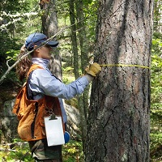

# SLR Summary {#SLRSummary}
Specific parts of a full Simple Linear Regression (SLR) analysis were described in Modules \@ref(SLRFoundations)-\@ref(SLRTransformations). In this module, a workflow for a full analysis is offered and that workflow is demonstrated with several examples.

## Suggested Workflow
The following is a process for fitting a SLR. Consider this process as you learn to fit SLR models, but don't consider this to be a concrete process for all models.

<!----
1. Perform a thorough EDA. Pay close attention to the form, strength, and outliers on the scatterplot of the response and explanatory variables.
---->
1. Show the overall sample size.
1. Address the independence assumption.
    * If this assumption is not met then other analysis methods must be used.
1. Fit the untransformed full model with `lm()`.
1. Check the other four assumptions for the untransformed model with `assumptionCheck()`. 
    * Check the linearity of the relationship with the residual plot.
    * Check homoscedasticity with the residual plot.
    * Check normality of residuals with an Anderson-Darling test and histogram of residuals.
    * Check outliers and influential points with the outlier test and residual plot.
1. If an assumption or assumptions are violated, then attempt to find a transformation where the assumptions are met.
    * Use trial-and-error with `assumptionCheck()`, theory (e.g., power or exponential functions), or experience to identify possible transformations for the response variable and, possibly, for the explanatory variable.
        * Attempt transformations with the response variable first.
        * Generally only ever transform the explanatory variable with logarithms.
    * If only an outlier or influential observation exists (i.e., linear, homoscedastic, and normal residuals) and no transformation corrects the "problem", then consider removing that observation from the data set.
    * Fit the full model with the transformed variable(s) or reduced data set.
1. Construct an ANOVA table for the full model with `anova()` and interpret the overall F-test.
1. Summarize findings with coefficient results and confidence intervals with `cbind(coef(),confint())`.
1. Create a summary graphic of the fitted line with 95% confidence band using `ggplot()`.
1. Make predictions with `predict()`, if desired.
1. Write a succinct conclusion of your findings.

&nbsp;

## Climate Change Data (*No Transformation*)

Climate researchers examined the relationship between [global temperature anomaly](https://climate.nasa.gov/vital-signs/global-temperature/) and the [concentration of CO<sub>2</sub> in the atmosphere](https://climate.nasa.gov/vital-signs/carbon-dioxide/). Temperature anomaly data were recorded as the Global Land-Ocean Temperature Index from the Goddard Institute of Space Studies ([GISTEMP](https://data.giss.nasa.gov/gistemp/)) in units of 1/100<sup>o</sup>C increase above the 1950-1980 mean. The CO<sub>2</sub> data are from The Earth System Research Laboratory of the National Oceanic and Atmospheric Administration ([ESRL-NOAA](https://www.esrl.noaa.gov/)). Specifically, these data are a record of annual mean atmospheric CO<sub>2</sub> concentration at [Mauna Loa Observatory](https://www.esrl.noaa.gov/gmd/obop/mlo/) Hawaii, which constitute the longest continuous record of atmospheric CO<sub>2</sub> concentrations. This remote location at high altitude in Hawaii was chosen because it is relatively unaffected by any local emissions and so is representative of the global concentration of a well-mixed gas like CO<sub>2</sub>. These observations were started by [C. David Keeling](https://scrippsco2.ucsd.edu/history_legacy/charles_david_keeling_biography.html) of the [Scripps Institution of Oceanography](https://scripps.ucsd.edu/) in March of 1958 and are often referred to as [the Keeling Curve](https://keelingcurve.ucsd.edu/). Data are reported as a dry mole fraction defined as the number of molecules of carbon dioxide divided by the number of molecules of dry air multiplied by one million (ppm). Our goal here is to determine if the variability in the temperature anomaly records can be reasonably explained by the CO<sub>2</sub> values in the same year.

The statistical hypotheses to be examined are

$$
\begin{split}
\text{H}_{\text{0}}&: ``\text{no relationship between temperature anomaly and CO2 values''} \\
\text{H}_{\text{A}}&: ``\text{is a relationship between temperature anomaly and CO2 values''} \\
\end{split}
$$
```{r echo=FALSE}
cc <- read.csv("http://derekogle.com/NCMTH107/modules/CE/GSI_data.csv")
n <- nrow(cc)
lm.cc <- lm(Temp~CO2,data=cc)
ad.p.cc <- adTest(lm.cc$residuals)$p.value
out.p.cc <- outlierTest(lm.cc)$bonf.p
aov.p.cc <- anova(lm.cc)$"Pr(>F)"[1]
cfs.cc <- cbind(Est=coef(lm.cc),confint(lm.cc))
nd <- data.frame(CO2=360)
c360 <- predict(lm.cc,newdata=nd,interval="confidence")
```

Data were recorded for `r n` years. The data between years is likely not independent as knowing the temperature anomaly and CO<sub>2</sub> values in any given year likely are a good indicator of the values in the next year. This temporal dependence should probably be included in the analysis. However, these data are recorded on an annual basis and it does not make much sense to include only a random sample of years. Thus, to better understand the relationship between these two variables, I will continue with this analysis assuming independence.

The assumptions are met as the residual plots show no obvious curvature or funneling (Figure \@ref(fig:CCAssumptions1)-Right), the histogram of residuals is not strongly skewed (Figure \@ref(fig:CCAssumptions1)-Left; Anderson-Darling `r kPvalue(ad.p.cc,latex=FALSE)`), and there are no obvious outliers (`r kPvalue(out.p.cc,latex=FALSE)`). Thus, the analysis can continue without any transformations.

```{r CCAssumptions1, echo=FALSE, fig.width=7, fig.cap="Histogram of residuals (Left) and residual plot (Right) for a simple linear regression of temperature anomaly on CO2 data."}
assumptionCheck(lm.cc)
```

&nbsp;

The temperature anomaly and CO<sub>2</sub> data appear to be significantly related (`r kPvalue(aov.p.cc,latex=FALSE)`; Table \@ref(tab:ccANOVA)). In fact, `r formatC(100*rSquared(lm.cc),format="f",digits=1)`% of the variability in the temperature anomaly is explained by knowing the value of the CO<sub>2</sub> concentration.

&nbsp;

```{r ccANOVA, echo=FALSE}
knitr::kable(anova(lm.cc),booktabs=TRUE,digits=c(0,1,1,3,4),
             caption="ANOVA table for simple linear regression of temperature anomaly on CO2 data.") %>%
  kableExtra::kable_classic("hover",full_width=FALSE,html_font=khfont) %>%
  kableExtra::column_spec(1:6,width="0.9in") %>%
  kableExtra::column_spec(2,width="0.4in")
```

&nbsp;

In fact, it appears that as as the CO<sub>2</sub> levels increase by 1 ppm then the mean temperature anomaly increases by between `r formatC(cfs.cc["CO2","2.5 %"],format="f",digits=2)` and `r formatC(cfs.cc["CO2","97.5 %"],format="f",digits=2)` 1/100<sup>o</sup>C (Table \@ref(tab:ccCoefs); Figure \@ref(fig:ccFitPlot)).

&nbsp;

```{r ccCoefs, echo=FALSE}
knitr::kable(cfs.cc,booktabs=TRUE,digits=c(2,2,2),
             caption="Intercept and slope, along with 95% confidence intervals, for simple linear regression of temperature anomaly on CO2 data.") %>%
  kableExtra::kable_classic("hover",full_width=FALSE,html_font=khfont) %>%
  kableExtra::column_spec(1:4,width="0.9in")
```

&nbsp;

```{r ccFitPlot, echo=FALSE, fig.cap="Scatterplot of temperature anomaly versuse CO2 concentration with the best-fit line and 95% confidence band superimposed."}
ggplot(data=cc,mapping=aes(x=CO2,y=Temp)) + 
  geom_point(pch=21,color="black",fill="lightgray") + 
  labs(x="CO2 Concentration (ppm)",y="Temperature Anomaly (1/100C)") + 
  theme_NCStats() + 
  geom_smooth(method="lm")
```

&nbsp;

Finally, the predicted mean temperature anomaly for all times when the CO<sub>2</sub> concentration was 360 ppm is between `r formatC(c360[1,"lwr"],format="f",digits=1)` and `r formatC(c360[1,"upr"],format="f",digits=1)` 1/100<sup>o</sup>C.

In conclusion, a significantly positive and strong relationship was found between the mean temperature anomaly and the global CO<sub>2</sub> concentration. A model was developed from this relationship that can be used to predict the temperatuare anomaly from the CO<sub>2</sub> concentration.


#### R Code and Results {-}
```{r prompt=FALSE, results="hide", fig.show="hide"}
cc <- read.csv("http://derekogle.com/NCMTH107/modules/CE/GSI_data.csv")
str(cc)
lm.cc <- lm(Temp~CO2,data=cc)
assumptionCheck(lm.cc)
anova(lm.cc)
rSquared(lm.cc)
cbind(Est=coef(lm.cc),confint(lm.cc))
<<ccFitPlot>>
nd <- data.frame(CO2=360)
predict(lm.cc,newdata=nd,interval="confidence")
```

&nbsp;

## Forest Allometrics (Transformation)

Understanding the [carbon dynamics](https://terra.nasa.gov/science/carbon-cycle-and-ecosystems) in forests is important to understanding ecological processes and managing forests. The amount of carbon stored in a tree is related to tree biomass. Measuring the biomass of a tree is a tedious process that also results in the harvest (i.e., death) of the tree. However, biomass is often related to other simple metrics (e.g., [diameter-at-breast-height](https://en.wikipedia.org/wiki/Diameter_at_breast_heightfo) (DBH) or tree height) that can be made without harming the tree. Thus, forest scientists have developed a series of equations (called [allometric equations](https://en.wikipedia.org/wiki/Tree_allometry)) that can be used to predict tree biomass from simple metrics for a variety of trees in a variety of locations.

The [Miombo Woodlands](https://en.wikipedia.org/wiki/Central_Zambezian_miombo_woodlands) is the largest continuous dry [deciduous forest](https://biologydictionary.net/deciduous-forest/) in the world. It extends across much of Central, Eastern, and Southern Africa including parts of Angola, the Democratic Republic of Congo, Malawi, Mozambique, Tanzania, Zambia, and Zimbabwe. The woodlands are rich in plant diversity and have the potential to contain a substantial amount of carbon. There is, however, significant uncertainty in the amount of biomass carbon in the Miombo Woodlands. The objective of this study ([Kuyah *et al.* 2016](https://www.mdpi.com/1999-4907/7/2/13)) is to develop allometric equations that can be used to reliably estimate biomass of trees in the Miombo Woodlands so that biomass carbon can be more reliably estimated.

Trees for building allometric models were sampled from three 10 km by 10 km sites located in the districts of Kasungu, Salima, and Neno. A total of 88 trees (33 species) were harvested from six plots in Kasungu, seventeen plots in Salima, and five plots in Neno. The DBH (cm) of each tree was measured using diameter tape. Each tree was felled by cutting at the lowest possible point using a chainsaw. The length (m) of the felled tree was measured along the longest axis with a measuring tape. This measurement was used as the total tree height in the analysis. Felled trees were separated into stem, branches, and twigs (leaves and small branches). Total biomass (kg) of the tree (above-ground biomass; AGB) and the separate biomasses (kg) of the stems, branches, and twigs was recorded. The data are stored in TreesMiombo.csv ([data](https://raw.githubusercontent.com/droglenc/NCData/master/TreesMiombo.csv), [meta](https://github.com/droglenc/NCData/blob/master/TreesMiombo_meta.txt)). This analysis will attempt to predict AGB from DBH.

The statistical hypotheses to be examined are

$$
\begin{split}
\text{H}_{\text{0}}&: ``\text{no relationship between above ground biomass and diameter at breast height''} \\
\text{H}_{\text{A}}&: ``\text{is a relationship between above ground biomass and diameter at breast height''} \\
\end{split}
$$

```{r echo=FALSE}
tm <- read.csv("https://raw.githubusercontent.com/droglenc/NCData/master/TreesMiombo.csv")
tm <- filterD(tm,!outlier)
tm$logDBH <- log(tm$DBH)
tm$logAGB <- log(tm$AGB)
lm.tm1 <- lm(AGB~DBH,data=tm)
ad.p.tm1 <- adTest(lm.tm1$residuals)$p.value
out.p.tm1 <- outlierTest(lm.tm1)$bonf.p
lm.tm2 <- lm(logAGB~logDBH,data=tm)
ad.p.tm2 <- adTest(lm.tm2$residuals)$p.value
out.p.tm2 <- outlierTest(lm.tm2)$bonf.p

aov.p.tm2 <- anova(lm.tm2)$"Pr(>F)"[1]
cfs.tm2 <- cbind(Est=coef(lm.tm2),confint(lm.tm2))
btcfs.tm2 <- exp(cfs.tm2)
nd <- data.frame(logDBH=log(50))
pl50 <- predict(lm.tm2,newdata=nd,interval="prediction")
p50 <- exp(pl50)
```

There is some concern over independence because some of the trees presumably came from the same plot and it is possible that one tree might have an impact on another tree. That impact may have been on the overall growth of the tree through density-dependent factors, but it is hard to imagine how one tree could effect another tree with respect to the *relationship* between above ground biomass and diameter at breast height. Thus, I will continue with this analysis assuming independence.

The residual plot (Figure \@ref(fig:tmAssumptions1)-Right) indicates a lack of linearity and homoscedasticity as there is both a clear curve and funnel present. There also appears to be a lack of normality in the residuals (Anderson-Darling `r kPvalue(ad.p.tm1,latex=FALSE)`) and the presence of outliers (outlier test `r kPvalue(out.p.tm1,latex=FALSE)`). These results all indicate that a transformation should be explored.

```{r tmAssumptions1, echo=FALSE, fig.width=7, fig.cap="Histogram of residuals (Left) and residual plot (Right) for a simple linear regression of above ground biomass on diameter at breast height for trees from the Miombo Woodlands."}
assumptionCheck(lm.tm1)
```

&nbsp;

Allometric relationships between weights (i.e., biomass) and lengths (i.e., height) tend to follow a power function, which can be linearized by log-transforming both variables. When both variables were transformed the relationship was largely linear and homoscedastic (Figure \@ref(fig:tmAssumptions2)-Right), the residuals appeared to be normal (Anderson-Darling `r kPvalue(ad.p.tm2,latex=FALSE)`; Figure \@ref(fig:tmAssumptions2)-Left), and no outliers were present (outlier test `r kPvalue(out.p.tm2,latex=FALSE)`). Thus, the linear regression model was fit to the log-log transformed data as all assumptions were met on this scale.

&nbsp;

```{r tmAssumptions2, echo=FALSE, fig.width=7, fig.cap="Histogram of residuals (Left) and residual plot (Right) for a simple linear regression of log above ground biomass on log diameter at breast height for trees from the Miombo Woodlands."}
assumptionCheck(lm.tm1,lambday=0,lambdax=0)
```

&nbsp;

The log above ground biomass and log diameter at breast height appear to be significantly related (`r kPvalue(aov.p.tm2,latex=FALSE)`; Table \@ref(tab:tmANOVA)). In fact, `r formatC(100*rSquared(lm.tm2),format="f",digits=1)`% of the variability in the log above ground biomass is explained by knowing the value of the log diameter at breast height.

&nbsp;

```{r tmANOVA, echo=FALSE}
knitr::kable(anova(lm.tm2),booktabs=TRUE,digits=c(0,2,2,2,4),
             caption="ANOVA table for simple linear regression of log above ground biomass on log diameter at breast height for trees from the Miombo Woodlands.") %>%
  kableExtra::kable_classic("hover",full_width=FALSE,html_font=khfont) %>%
  kableExtra::column_spec(1:6,width="0.9in") %>%
  kableExtra::column_spec(2,width="0.4in")
```

&nbsp;

It appears that as as the log diameter at breast height increases by 1 unit then the mean log above ground biomass increases by between `r formatC(cfs.tm2["logDBH","2.5 %"],format="f",digits=2)` and `r formatC(cfs.tm2["logDBH","97.5 %"],format="f",digits=2)` units (Table \@ref(tab:tmCoefs); Figure \@ref(fig:tmFitPlot)). More importantly, as the diameter at breast height increases by a multiple of 2.718 the mean above ground biomass increases by a multiple of between `r formatC(btcfs.tm2["logDBH","2.5 %"],format="f",digits=2)` and `r formatC(btcfs.tm2["logDBH","97.5 %"],format="f",digits=2)`.

&nbsp;

```{r tmCoefs, echo=FALSE}
knitr::kable(cfs.tm2,booktabs=TRUE,digits=c(2,2,2),
             caption="Intercept and slope, along with 95% confidence intervals, for simple linear regression of log above ground biomass on log diameter at breast height for trees from the Miombo Woodlands.") %>%
  kableExtra::kable_classic("hover",full_width=FALSE,html_font=khfont) %>%
  kableExtra::kable_classic("hover",full_width=FALSE,html_font=khfont) %>%
  kableExtra::column_spec(1:4,width="0.9in")
```

&nbsp;

```{r tmFitPlot, echo=FALSE, fig.cap="Scatterplot of log above ground biomass on log diameter at breast height for trees from the Miombo Woodlands. with the best-fit line and 95% confidence band superimposed."}
ggplot(data=tm,mapping=aes(x=logDBH,y=logAGB)) + 
  geom_point(pch=21,color="black",fill="lightgray") + 
  labs(x="log Diameter at Breast Height",y="log Above Ground Biomass") + 
  theme_NCStats() + 
  geom_smooth(method="lm")
```

&nbsp;

Finally, the predicted above ground biomass for a tree with a diameter at breast height of 50 cm is between `r formatC(p50[1,"lwr"],format="f",digits=1)` and `r formatC(p50[1,"upr"],format="f",digits=1)` kg.

In conclusion, a significantly positive and very strong relationship was found between the natural log above-ground biomass and the natural log diameter-at-breast-height for trees in the Miombo Woodlands. A model was developed from this relationship that can be used to predict above-ground biomass of a tree from the measured DBH of the tree.

#### R Code and Results {-}
```{r prompt=FALSE, results="hide", fig.show="hide"}
tm <- read.csv("https://raw.githubusercontent.com/droglenc/NCData/master/TreesMiombo.csv")
tm <- filterD(tm,!outlier)   ## data entry error removed
lm.tm1 <- lm(AGB~DBH,data=tm)
assumptionCheck(lm.tm1)
assumptionCheck(lm.tm1,lambday=0,lambdax=0)
tm$logDBH <- log(tm$DBH)
tm$logAGB <- log(tm$AGB)
lm.tm2 <- lm(logAGB~logDBH,data=tm)
anova(lm.tm2)
rSquared(lm.tm2)
<<tmFitPlot>>
( cfs.tm2 <- cbind(Est=coef(lm.tm2),confint(lm.tm2)) )
exp(cfs.tm2)
nd <- data.frame(logDBH=log(50))
( pl50 <- predict(lm.tm2,newdata=nd,interval="prediction") )
exp(pl50)
```

&nbsp;
