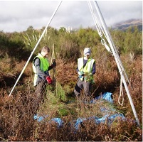

# IVR Summary {#IVRSummary}
Specific parts of a full Indicator Variable Regression (IVR) analysis were described in Modules \@ref(IVRVariables)-\@ref(IVRAnalysis). In this module, a workflow for a full analysis is offered and that workflow is demonstrated with several examples.

## Suggested Workflow {#IVRWorkflow}
The following is a process for fitting an IVR. Consider this process as you learn to fit IVR models, but don’t consider this to be a concrete process for all models.

<!----
1. Perform a thorough EDA. Pay close attention to the form, strength, and outliers on the scatterplot of the response and explanatory variables separated by each level of the factor (You can add `facet_wrap(vars(FACTOR)))` (where `FACTOR` is replaced with the factor variable in the IVR) to `ggplot()` code that constructs a scatterplot to separate by groups.)
---->
1. Briefly introduce the study (i.e., provide some background for why this study is being conducted).
1. State the hypotheses to be tested.
1. Show the sample size per group using `xtabs()` and comment on whether the study was balanced (i.e., same sample size per group) or not.
1. Assess the independence assumption.
    * If this assumption is not met then other analysis methods must be used.
1. Fit the untransformed ultimate full model with `lm()`.
1. Check the other four assumptions for the untransformed model with `assumptionCheck()`.
    * Check linearity of the relationship with the residual plot.
    * Check homoscedasticity with the residual plot.
    * Check normality of residuals with an Anderson-Darling test and histogram of residuals.
    * Check outliers and influential points with the outlier test and residual plot.
1. If an assumption or assumptions are violated, then attempt to find a transformation where the assumptions are met.
    * Use trial-and-error with `assumptionCheck()`, theory (e.g., power or exponential functions), or experience to identify possible transformations for the response variable and, possibly, for the explanatory variable.
        * Attempt transformations with the response variable first.
        * Generally only ever transform the explanatory variable with logarithms.
    * If only an outlier or influential observation exists (i.e., linear, homoscedastic, and normal residuals) and no transformation corrects the “problem,” then consider removing that observation from the data set.
    * Fit the ultimate full model with the transformed variable(s) or reduced data set.
1. Construct an ANOVA table for the ultimate full model with `anova()`.
    * If a significant interaction exists then do NOT interpret the main effects!!
    * If a significant interaction does NOT exist then interpret the main effects (i.e., interpret the coincident lines and relationship test p-values).
1. As appropriate, perform multiple comparisons to identify specific differences.
    * If a significant interact exists (i.e., non-parallel lines) then use `emtrends()` and `summary()` to identify specific slopes that differ.
    * If a significant interaction does not exist (i.e., parallel lines) but the lines are not coincident (i.e., different slopes) ...
        * Fit a new model without the insignificant interaction term.
        * Use `emmeans()` and `summary()` to identify specific mean values of the response at the mean value of the covariate that differ.
1. Create a summary graphic of the fitted lines using the `ggplot()`.
    * Include the 95% confidence band and the observed data as long as the plot is not overly cluttered. If it is, just show the fitted lines.
1. Make predictions with `predict()`, if desired.
1. Write a succinct conclusion of your findings. Make sure you address ...
    * whether the relationship between the response variable and the covariate differs among groups.
    * whether the mean value of the response variable at the mean value of the covariate differs among groups (if appropriate to address this).
    * whether there is a significant relationship between the response variable and the covariate (may need to do separately for each group).

&nbsp;

## Fish Energy Density (*No Transformation*)

Some ecologists study the transfer of energy through the ecosystem. Energy is passed up [trophic levels](https://www.britannica.com/science/trophic-level) through predation. How much energy is transferred depends on a number of things, including the energy density of the prey. [Hartman and Brandt (1995)](https://www.researchgate.net/profile/Kyle_Hartman/publication/250019672_Estimating_Energy_Density_of_Fish/links/0a85e52e51c7c8df25000000.pdf) provided a meta-analysis of energy densities for a wide variety of prey fishes. In one part of that study they more closely examined the energy densities of [Bay Anchovy](https://en.wikipedia.org/wiki/Anchoa_mitchilli) (*Anchoa mitchilli*), [Bluefish](https://en.wikipedia.org/wiki/Bluefish) (*Pomatomus saltatrix*), [Striped Bass](https://en.wikipedia.org/wiki/Striped_bass) (*Morone saxatilis*), and [Weakfish](https://en.wikipedia.org/wiki/Weakfish) (*Cynoscion regalis*) collected from [Chesapeake Bay](https://en.wikipedia.org/wiki/Chesapeake_Bay) , Maryland.

Hartman and Brandt (1995) were primarily interested in describing differences in energy density between the four species. However, it is commonly known that the amount of energy in a fish is partly dependent on the percent dry weight of the fish.^[Percent dry weight is the dry weight divided by the wet weight of the fish times 100.] Thus, their objectives were to (i) describe the relationship between energy density and dry weight and determine if that relationship differed among the four species and (ii) determine if the mean energy density at a constant dry weight differed among the four species.

The first hypothesis to be tested (i.e, parallel lines test) is

$$
\begin{split}
\text{H}_{\text{0}}&: ``\text{the relationship between energy density and dry weight does not differ by species''} \\
\text{H}_{\text{A}}&: ``\text{the relationship between energy density and dry weight does differ by species''} \\
\end{split}
$$

If this H<sub>0</sub> is not rejected (i.e., the lines are parallel) then the following two sets of hypotheses will be tested (i.e., coincident lines and relationship tests),

$$
\begin{split}
\text{H}_{\text{0}}&: ``\text{the mean energy density at the mean dry weight does not differ among species''} \\
\text{H}_{\text{A}}&: ``\text{the mean energy density at the mean dry weight does differ among species''} \\
\end{split}
$$

and

$$
\begin{split}
\text{H}_{\text{0}}&: ``\text{there is not a relationship between energy density and dry weight''} \\
\text{H}_{\text{A}}&: ``\text{there is a relationship between energy density and dry weight''} \\
\end{split}
$$

```{r NRGData, echo=FALSE, results="hide"}
nrg <- read.csv("http://derekogle.com/Book207/data/FishEnergyDensity.csv")
xtabs(~species,data=nrg)
ivr1.nrg <- lm(ed~dw+species+dw:species,data=nrg)
```

The sample size is quite unbalanced, with essentially twice as many Bay Anchovy as any other species (Table \@ref(tab:NRGSampleSize)). The sample size for Bluefish, Striped Bass, and Weakfish is quite small.

&nbsp;

```{r NRGSampleSize, echo=FALSE}
xtabs(~species,data=nrg) %>%
  knitr::kable(booktabs=TRUE,align="lr",
               caption="Sample size for each species.") %>%
  kableExtra::kable_classic("hover",full_width=FALSE,html_font=khfont) %>%
  kableExtra::column_spec(1:2,width="0.9in") %>%
  kableExtra::row_spec(0,bold=TRUE)
```

&nbsp;

There is very little information to fully assess independence. However, as long as any individual fish does not affect the dry weight or the energy density of any other fish, than the independence assumption is likely met. It is hard to imagine how any one fish could affect any other single fish for these two metrics, so I suspect that independence is adequately met.

```{r echo=FALSE}
ad.nrg.p <- kPvalue(adTest(ivr1.nrg$residuals)$p.value,latex=FALSE)
out.nrg.p <- kPvalue(outlierTest(ivr1.nrg)$bonf.p,latex=FALSE)
```

The residual plot (Figure \@ref(fig:NRGAssumptions1)-Right) does not exhibit any curvature or funneling pattern; thus the linearity and homoscedasticity assumptions are met. The residuals appear approximately normal (Anderson-Darling `r ad.nrg.p`; Figure \@ref(fig:NRGAssumptions1)-Left) and no outliers are present (outlier test `r out.nrg.p`). No transformation is needed as all assumptions appear to be met.

&nbsp;

```{r NRGAssumptions1, echo=FALSE, fig.width=7, fig.height=3.75, fig.cap="Histogram of residuals (left) and residual plot (right) for the IVR analysis of energy density by percent dry weight and species."}
assumptionCheck(ivr1.nrg)
```
```{r echo=FALSE}
aov1.nrg <- anova(ivr1.nrg)
plt.nrg <- kPvalue(aov1.nrg$"Pr(>F)"[3],latex=FALSE)
mc1.nrg <- emtrends(ivr1.nrg,specs=pairwise~species,var="dw")
mc1sum.nrg <- summary(mc1.nrg,infer=TRUE)
```

&nbsp;

The relationship between energy density and percent dry weight differed among some of the species (`r plt.nrg`; Table \@ref(tab:NRGANOVA1)). It appears that the slope for Bay Anchovy is less than the slope for all other species (p&leq;`r kPvalue(max(mc1sum.nrg$contrasts$p.value[1:3]),latex=FALSE,include.p=FALSE)`; Table \@ref(tab:NRGSlopes1)). The slopes do not differ among the other three species (p&geq;`r kPvalue(min(mc1sum.nrg$contrasts$p.value[4:6]),latex=FALSE,include.p=FALSE)`; Table \@ref(tab:NRGSlopes1)).

&nbsp;

```{r NRGANOVA1, echo=FALSE}
aov1.nrg %>%
  knitr::kable(booktabs=TRUE,digits=c(0,0,0,1,7),
               caption="ANOVA table for the IVR analysis of energy density by percent dry weight and species.") %>%
  kableExtra::kable_classic("hover",full_width=FALSE,html_font=khfont) %>%
  kableExtra::column_spec(1,width="0.8in") %>%
  kableExtra::column_spec(2,width="0.5in") %>%
  kableExtra::column_spec(3:4,width="1.1in") %>%
  kableExtra::column_spec(5:6,width="0.9in") %>%
  kableExtra::row_spec(0,bold=TRUE)
```

&nbsp;

```{r NRGSlopes1, echo=FALSE}
mc1sum.nrg$contrasts[,c(1,2,5,6,8)] %>%
  knitr::kable(booktabs=TRUE,digits=c(0,1,1,1,4),
               caption="Tukey's multiple comparisons for all pairs of slopes for the IVR analysis of energy density by percent dry weight and species.") %>%
  kableExtra::kable_classic("hover",full_width=FALSE,html_font=khfont) %>%
  kableExtra::column_spec(1,width="2.0in") %>%
  kableExtra::column_spec(2:5,width="0.8in") %>%
  kableExtra::row_spec(0,bold=TRUE)
```

```{r NRGData2, echo=FALSE}
nrg2 <- filter(nrg,species!="bayanchovy")
ivr2.nrg <- lm(ed~dw+species,data=nrg2)
```
```{r echo=FALSE, results="hide"}
aov2.nrg <- anova(ivr2.nrg)
mc2.nrg <- emmeans(ivr2.nrg,specs=pairwise~species)
( mc2sum.nrg <- summary(mc2.nrg,infer=TRUE) )
```

&nbsp;

As only Bay Anchovy had a different slope, I removed this species so that I could determine how the mean energy density at the mean percent dry weight differed among the the other three species. Assuming parallel lines for these three species (from the analysis above), it appears that the intercepts differed among some of the species (`r kPvalue(aov2.nrg$"Pr(>F)"[2],latex=FALSE)`; Table \@ref(tab:NRGANOVA2)). Tukey's multiple comparisons indicate that the intercept for Bluefish is less than the intercept for both Striped Bass and Weakfish (p&leq;`r kPvalue(max(mc2sum.nrg$contrasts$p.value[1:2]),latex=FALSE,include.p=FALSE)`; Table \@ref(tab:NRGIntercepts2)). The intercepts for Striped Bass and Weakfish did not differ (`r kPvalue(mc2sum.nrg$contrasts$p.value[3],latex=FALSE)`; Table \@ref(tab:NRGIntercepts2)).

&nbsp;

```{r NRGANOVA2, echo=FALSE}
aov2.nrg %>%
  knitr::kable(booktabs=TRUE,digits=c(0,0,0,1,5),
               caption="ANOVA table for the IVR analysis of energy density by percent dry weight and species with Bay Anchovy excluded and assuming parallel lines (from the previous analysis).") %>%
  kableExtra::kable_classic("hover",full_width=FALSE,html_font=khfont) %>%
  kableExtra::column_spec(1,width="0.8in") %>%
  kableExtra::column_spec(2,width="0.5in") %>%
  kableExtra::column_spec(3:4,width="1.1in") %>%
  kableExtra::column_spec(5:6,width="0.9in") %>%
  kableExtra::row_spec(0,bold=TRUE)
```

&nbsp;

```{r NRGIntercepts2, echo=FALSE}
mc2sum.nrg$contrasts[,c(1,2,5,6,8)] %>%
  knitr::kable(booktabs=TRUE,digits=c(0,1,1,1,4),
               caption="Tukey's multiple comparisons for all pairs of mean energy density at the mean percent dry weight by species.") %>%
  kableExtra::kable_classic("hover",full_width=FALSE,html_font=khfont) %>%
  kableExtra::column_spec(1,width="2.0in") %>%
  kableExtra::column_spec(2:5,width="0.8in") %>%
  kableExtra::row_spec(0,bold=TRUE)
```

&nbsp;

Through this analysis it appears that Bay Anchovy has a less steep relationship between energy density and percent dry weight than the other species (Figure \@ref(fig:NRGFitPlot)). So, energy density does not increase as quickly with increasing dry weight for Bay Anchovy as it does for the other species. Among the other species, it appears that Bluefish has a lower mean energy density at all percent dry weights than Striped Bass and Weakfish. Striped Bass and Weakfish appear to have the same mean energy density at all percent dry weights. Thus, for fish of the same percent dry weight, Striped Bass and Weakfish have a higher mean energy density than Bluefish.

&nbsp;

```{r NRGFitPlot, echo=FALSE, fig.width=5, fig.cap="Fitted lines for the regression of energy density on percent dry weight separated by species of fish."}
ggplot(data=nrg,mapping=aes(x=dw,y=ed,color=species,fill=species)) + 
  geom_point() + 
  labs(x="Percent Dry Weight",y="Energy Density (J/g)") + 
  theme_NCStats() + 
  geom_smooth(method="lm",alpha=0.15)
```

&nbsp;

#### R Code and Results {-}
```{r prompt=FALSE, results="hide", fig.show="hide", warning=FALSE, message=FALSE}
<<NRGData>>
<<NRGAssumptions1>>
anova(ivr1.nrg)
mc1.nrg <- emtrends(ivr1.nrg,specs=pairwise~species,var="dw")
( mc1sum.nrg <- summary(mc1.nrg,infer=TRUE) )
<<NRGData2>>
anova(ivr2.nrg)
mc2.nrg <- emmeans(ivr2.nrg,specs=pairwise~species)
( mc2sum.nrg <- summary(mc2.nrg,infer=TRUE) )
<<NRGFitPlot>>
```

&nbsp;

## Shrub Allometry (*Transformation*)

[Allometric models](https://en.wikipedia.org/wiki/Tree_allometry) are useful for assessing above-ground biomass (AGB) and net [primary productivity](https://en.wikipedia.org/wiki/Primary_production) (ANPP) of forests and shrubs. These models are widely used for forest inventory and management because they offer a non-destructive, relatively accurate, and labor-efficient method for estimating these difficult to measure metrics. The AGB and ANPP of plants are important components of the [global carbon cycle](https://oceanservice.noaa.gov/facts/carbon-cycle.html). Above-ground biomass can be used to quantify carbon stores in plants and ANPP can help to understand potential future carbon storage. Thus, the prediction of AGB and ANPP of plants will help to evaluate terrestrial [carbon sequestration](https://www.usgs.gov/faqs/what-carbon-sequestration?qt-news_science_products=0#), which is important for mitigation of global climate change. 

Allometric models to be used for these purposes are developed for individual tree and shrub species, oftentimes for different habitats. [She *et al.* (2015)](https://www.researchgate.net/publication/287346484_Habitat_Effect_on_Allometry_of_a_Xeric_Shrub_Artemisia_ordosica_Krasch_in_the_Mu_Us_Desert_of_Northern_China) examined allometric relationships for the [xeric](https://www.sunset.com/garden/xeric-water-wise-drought-tolerant-what-does-it-all-mean) shrub [*Artemisia*](https://en.wikipedia.org/wiki/Artemisia_(genus)) *ordosica*, a species endemic to the [Mu Us Desert](https://en.wikipedia.org/wiki/Mu_Us_Desert) in China. In one part of their analysis they used crown area (CA; m<sup>2</sup>) and habitat type to explain variability in AGB (kg) of individual *Artemisia* shrubs. Three habitats were considered – semi-fixed dunes (SF), fixed dunes (FD), and fixed dunes with soil crusts (FC). All individual *Artemisia* plants were sampled from three plots that were 2-4 km separated. In their model fitting they assumed that the relationship between AGB and CA followed a power function, as is typical for many allometric relationships.

The first hypothesis to be tested (i.e, parallel lines test) is

$$
\begin{split}
\text{H}_{\text{0}}&: ``\text{the relationship between AGB an CA does not differ by habitat''} \\
\text{H}_{\text{A}}&: ``\text{the relationship between AGB an CA does differ by habitat''} \\
\end{split}
$$

If this H<sub>0</sub> is not rejected (i.e., the lines are parallel) then the following two sets of hypotheses will be tested (i.e., coincident lines and relationship tests),

$$
\begin{split}
\text{H}_{\text{0}}&: ``\text{the mean AGB at the mean CA does not differ among habitats''} \\
\text{H}_{\text{A}}&: ``\text{the mean AGB at the mean CA does differ among habitats''} \\
\end{split}
$$

and

$$
\begin{split}
\text{H}_{\text{0}}&: ``\text{there is not a relationship between ABG and CA''} \\
\text{H}_{\text{A}}&: ``\text{there is a relationship between AGB and CA''} \\
\end{split}
$$

```{r ShrubData, echo=FALSE, results="hide"}
shrub <- read.csv("http://derekogle.com/Book207/data/Artemisia.csv")
xtabs(~Habitat,data=shrub)
ivr1.shrub <- lm(AGB~CA+Habitat+CA:Habitat,data=shrub)
```

The sample size is unbalanced, with essentially 50% more *Artemisia* sampled in semi-fixed (SF) dunes than the other two habitats (Table \@ref(tab:ShrubSampleSize)). The sample sizes are not large but are likely adequate in all habitats.

&nbsp;

```{r ShrubSampleSize, echo=FALSE}
xtabs(~Habitat,data=shrub) %>%
  knitr::kable(booktabs=TRUE,align="lr",
               caption="Sample size of individual plants by habitat.") %>%
  kableExtra::kable_classic("hover",full_width=FALSE,html_font=khfont) %>%
  kableExtra::column_spec(1:2,width="0.8in") %>%
  kableExtra::row_spec(0,bold=TRUE)
```

&nbsp;

Independence of individual plants is questionable both within- and among- groups. Though the three plots were spatially separated, it appears that multiple plants were sampled in each plot. Thus, there could be an effect of one plant on another plant in the same plot. That being said, it is hard to imagine that one plant could affect the *relationship* between crown area and above-ground biomass of another plant in the same plot. Thus, I will tentatively continue assuming independence.

```{r ShrubTransformation, echo=FALSE}
shrub$logAGB <- log(shrub$AGB)
shrub$logCA <- log(shrub$CA)
ivr1t.shrub <- lm(logAGB~logCA+Habitat+logCA:Habitat,data=shrub)
```

```{r echo=FALSE}
ad.shrub.p <- kPvalue(adTest(ivr1.shrub$residuals)$p.value,latex=FALSE)
out.shrub.p <- kPvalue(outlierTest(ivr1.shrub)$bonf.p,latex=FALSE)
ad.shrub.pt <- kPvalue(adTest(ivr1t.shrub$residuals)$p.value,latex=FALSE)
out.shrub.pt <- kPvalue(outlierTest(ivr1t.shrub)$bonf.p,latex=FALSE)
```

Allometric relationships often follow a power function, thus the assumptions are likely not met on the original untransformed scale. Indeed, the residual plot (Figure \@ref(fig:ShrubAssumptions1)-Right) shows a clear curvature and heteroscedasticity. A power function relationship suggests that both the response and covariate should be log-transformed. With both variables log-transformed the residual plot (Figure \@ref(fig:ShrubAssumptions2)-Right) exhibits no curvature or funnel-shape, which indicates that the linearity and homoscedasticity assumptions are met on this scale. The residuals are approximately normal (Anderson-Darling `r ad.shrub.pt`; Figure \@ref(fig:ShrubAssumptions2)-Left) and no outliers are present (outlier test `r out.shrub.pt`). The analysis will continue on the log-log scale as all assumptions appear to be met on this scale.

&nbsp;

```{r ShrubAssumptions1, echo=FALSE, fig.width=7, fig.height=3.75, fig.cap="Histogram of residuals (Left) and residual plot (Right) for the IVR of above-ground biomass on crown area for three dune habitats."}
assumptionCheck(ivr1.shrub)
```

&nbsp;

```{r ShrubAssumptions2, echo=FALSE, fig.width=7, fig.height=3.75, fig.cap="Histogram of residuals (Left) and residual plot (Right) for the IVR of log-transformed above-ground biomass on log-transformed crown area for three dune habitats."}
assumptionCheck(ivr1.shrub,lambday=0,lambdax=0)
```
```{r echo=FALSE}
aov1.shrub <- anova(ivr1t.shrub)
plt.shrub <- kPvalue(aov1.shrub$`Pr(>F)`[3],latex=FALSE)
clt.shrub <- kPvalue(aov1.shrub$`Pr(>F)`[2],latex=FALSE)
rt.shrub <- kPvalue(aov1.shrub$`Pr(>F)`[1],latex=FALSE)
```

&nbsp;

The relationship between log above-ground biomass and log crown area does not differ among *Artemisia* sampled from the different habitats (`r plt.shrub`; Table \@ref(tab:ShrubANOVA1)). There does appear to be a significant relationship between log above-ground biomass and log crown area for *Artemisia* (`r rt.shrub`; Table \@ref(tab:ShrubANOVA1)). Finally, it appears that the mean log above-ground biomass at all log crown areas differs between some of the habitats (`r clt.shrub`; Table \@ref(tab:ShrubANOVA1)).

&nbsp;

```{r ShrubANOVA1, echo=FALSE}
aov1.shrub %>%
  knitr::kable(booktabs=TRUE,digits=c(0,2,2,2,4),
               caption="ANOVA table for the IVR of log-transformed above-ground biomass on log-transformed crown area for three dune habitats.") %>%
  kableExtra::kable_classic("hover",full_width=FALSE,html_font=khfont) %>%
  kableExtra::column_spec(1,width="0.8in") %>%
  kableExtra::column_spec(2,width="0.5in") %>%
  kableExtra::column_spec(3:6,width="0.8in") %>%
  kableExtra::row_spec(0,bold=TRUE)
```

```{r ShrubModel2, echo=FALSE, results="hide"}
ivr2t.shrub <- lm(logAGB~logCA+Habitat,data=shrub)
mc2t.shrub <- emmeans(ivr2t.shrub,specs=pairwise~Habitat,trans="log")
( mc2tsum.shrub <- summary(mc2t.shrub,infer=TRUE,type="response") )
```
```{r echo=FALSE}
mc2tsum.shrub.LCIs <- formatC(mc2tsum.shrub$contrasts$lower.CL,format="f",digits=3)
mc2tsum.shrub.UCIs <- formatC(mc2tsum.shrub$contrasts$upper.CL,format="f",digits=3)
```

&nbsp;

The back-transformed mean above-ground biomass at the back-transformed mean crown area differs among all habitats (p&leq;`r kPvalue(max(mc2tsum.shrub$contrasts$p.value),latex=FALSE, include.p=FALSE)`; Table \@ref(tab:ShrubIntercepts2)). The back-transformed mean above-ground biomass at the back-transformed mean crown area is between `r mc2tsum.shrub.LCIs[1]` and `r mc2tsum.shrub.UCIs[1]`% greater in the soil crust (FC) than fixed dune (FD) habitats, between `r mc2tsum.shrub.LCIs[2]` and `r mc2tsum.shrub.UCIs[2]` times greater in the soil crust (FC) than semi-fixed dune (FD) habitats, and between `r mc2tsum.shrub.LCIs[3]` and `r mc2tsum.shrub.UCIs[3]` times greater in the fixed dune (FD) than semi-fixed dune habitats (Table \@ref(tab:ShrubIntercepts2)).

&nbsp;

```{r ShrubIntercepts2, echo=FALSE}
mc2tsum.shrub$contrasts[,c(1,2,5,6,8)] %>%
  knitr::kable(booktabs=TRUE,digits=c(0,3,3,3,6),
               caption="Tukey's multiple comparisons for the RATIO mean above-ground biomass at the mean log crown areas for each pair of habitats") %>%
  kableExtra::kable_classic("hover",full_width=FALSE,html_font=khfont) %>%
  kableExtra::column_spec(1,width="0.7in") %>%
  kableExtra::column_spec(2:4,width="0.8in") %>%
  kableExtra::column_spec(5,width="1.0in") %>%
  kableExtra::row_spec(0,bold=TRUE)
```

&nbsp;

A positive relationship was found between log above-ground biomass and log crown area that did not differ between habitat types (Figure \@ref(fig:ShrubFitPlot)). The mean above-ground biomass for plants with the same crown area was greater for *Artemisia* in the surface crust habitats than in the fixed dunes habitats which were greater than in the semi-fixed dunes habitats (Figure \@ref(fig:ShrubMeansPlot)). In other words, it appears that the above-ground biomass is greater in the surface crust habitats than fixed-dunes than semi-fixed dunes for plants with the same crown area.

&nbsp;

```{r ShrubFitPlot, echo=FALSE, fig.width=4.5, fig.cap="Fitted lines for the regression of log above-ground biomass on log crown area separated by habitats. Note that these lines are statistically parallel, have statistically different intercepts, and exhibit a statistically positive relationship."}
ggplot(data=shrub,mapping=aes(x=logCA,y=logAGB,color=Habitat,fill=Habitat)) + 
  geom_point() + 
  labs(x="log Crown Area",y="log Above-Ground Biomass") + 
  theme_NCStats() + 
  geom_smooth(method="lm",alpha=0.15)
```

&nbsp;

```{r ShrubMeansPlot, echo=FALSE, fig.cap="Back-transformed mean above-ground biomass of *Artemisia* (and 95% confidence interval) at the back-transformed mean crown area for each habitat (FC=surface crust, FC=fixed-dune, and SF=semi-fixed dune)."}
ggplot(data=mc2tsum.shrub$emmeans,
       mapping=aes(x=Habitat,y=response,ymin=lower.CL,ymax=upper.CL)) +
  geom_errorbar(size=2,width=0) +
  geom_point(pch=21,fill="white") +
  labs(y="Mean Above-Ground Biomass (kg)",x="Habitat") +
  theme_NCStats()
```

&nbsp;

#### R Code and Results {-}
```{r prompt=FALSE, fig.show="hide", results="hide", message=FALSE, warning=FALSE}
<<ShrubData>>
assumptionCheck(ivr1.shrub)
assumptionCheck(ivr1.shrub,lambday=0,lambdax=0)
<<ShrubTransformation>>
anova(ivr1t.shrub)
<<ShrubModel2>>
<<ShrubFitPlot>>
<<ShrubMeansPlot>>
```

&nbsp;
